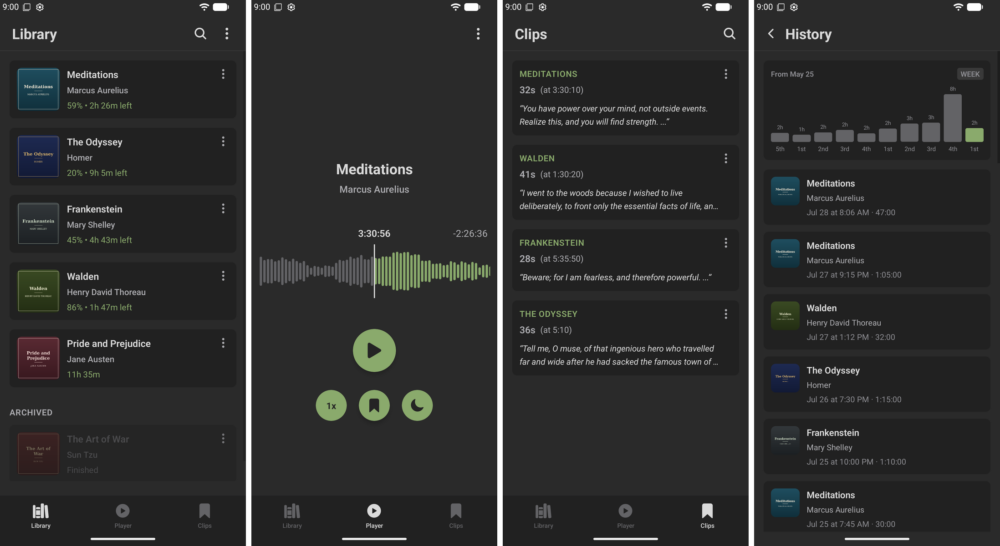

# Ivy

A local-first podcast and audiobook player for Android with library management, clips with on-device automatic transcription, listening history, multi-device sync via Google Drive and innovative player UI.



### AI Notice

This project was created with assistance from Claude.


## Development

Ivy is built, tested and driven by its own command-line tool at `script/toolkit.ts`.

### Prerequisites

- Node.js
- Android Studio with SDK installed, `ANDROID_HOME` environment variable set, `adb` on PATH
- [Maestro](https://maestro.mobile.dev) — e2e tests and app driving
- `sqlite3` — the `query` command

### Setup

```bash
npm install
```

### Common commands

```bash
npm start                                # dev client: build, install, Metro
npm test                                 # unit tests (jest)
script/toolkit.ts build debug --install  # build APK + install on device
script/toolkit.ts build release          # release APK + AAB (needs $KEYSTORE_PASSWORD)
script/toolkit.ts test --e2e             # maestro e2e suite
script/toolkit.ts doctor                 # environment + built-APK report
script/toolkit.ts help                   # full command reference
```


## License

MIT
